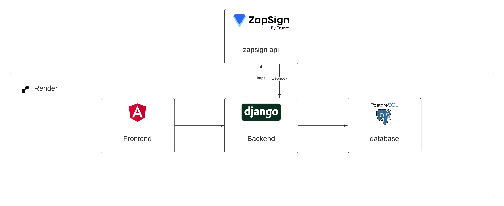

# Sign API

A simple CRUD application for managing documents, featuring integration with the ZapSign API for seamless electronic signature functionality



## Requirements

- Python 3.x
- Django 3.x
- Django REST framework

## Installation

1. Clone the repository:
    ```bash
    git clone https://github.com/yourusername/sign-api.git
    cd sign-api
    ```

2. Create a virtual environment and activate it:
    ```bash
    python3 -m venv venv
    source venv/bin/activate
    ```

3. Install the dependencies:
    ```bash
    pip install -r requirements.txt
    ```

4. Apply migrations:
    ```bash
    python manage.py migrate
    ```

5. Run the development server:
    ```bash
    python manage.py runserver
    ```

## Usage

To use the API, send requests to the endpoints defined in the `urls.py` file. You can use tools like `curl` or Postman to interact with the API.

## Running Tests

To run tests, use the following command:
```bash
python manage.py test
```

## Contributing

1. Fork the repository.
2. Create a new branch: `git checkout -b my-feature-branch`.
3. Make your changes and commit them: `git commit -m 'Add some feature'`.
4. Push to the branch: `git push origin my-feature-branch`.
5. Create a pull request.

## License

This project is licensed under the MIT License. See the [LICENSE](LICENSE) file for details.